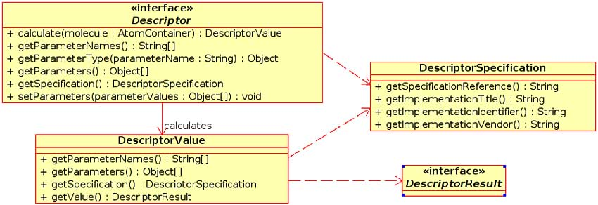

## The green Open Access version of the second CDK paper.

The [second paper](https://www.ingentaconnect.com/content/ben/cpd/2006/00000012/00000017/art00005)
was published in [Current Pharmaceutical Design](http://benthamscience.com/journals/current-pharmaceutical-design/)
with DOI [10.2174/138161206777585274](https://doi.org/10.2174/138161206777585274), and
was not published as (CC-BY) Open Access. However, SHERPA/RoMEO [reports](http://www.sherpa.ac.uk/romeo/search.php?issn=1381-6128)
that pre- or post-print versions can be archived (just not the publisher PDF). So here goes...

Copyright (C) 2016 The Authors.

Oh, and check our what [Wikidata](http://wikidata.org/) has knows about [this article with Scholia](https://tools.wmflabs.org/scholia/work/Q27065423)...

---

# Recent Developments of the Chemistry Development Kit (CDK) - An Open-Source Java Library for Chemo- and Bioinformatics

Christoph Steinbeck<sup>f</sup> <a href="https://orcid.org/0000-0001-6966-0814"></a>; Christian Hoppe<sup>f</sup>; Stefan Kuhn<sup>f</sup> <a href="https://orcid.org/0000-0002-5990-4157"></a>; Matteo Floris <a href="https://orcid.org/	0000-0003-4385-9336"></a>; Rajarshi Guha<sup>1</sup> <a href="https://orcid.org/0000-0001-7403-8819"></a>; Egon L. Willighagen<sup>§</sup> <a href="https://orcid.org/0000-0001-7542-0286"></a>

<sup>f</sup> Cologne University Bioinformatics Center (CUBIC), Cologne, Germany

<sup>1</sup> Pennsylvania State University, PA, USA

<sup>§</sup> Institute for Molecules and Materials, Radboud University Nijmegen, The Netherlands

## Abstract

The Chemistry Development Kit (CDK) provides methods for common tasks in molecular informatics, including 2D and 3D rendering of chemical structures, I/O routines, SMILES parsing and generation, ring searches, isomorphism checking, structure diagram generation, etc. Implemented in Java, it is used both for server-side computational services, possibly equipped with a web interface, as well as for applications and client-side applets. This article introduces the CDK's new QSAR capabilities and the recently introduced interface to statistical software.

## Introduction

Chemoinformatics is a scientific discipline, which attempts to solve problems in chemistry with methods devel-
oped in computer science. This rather broad definition by
Johann Gasteiger [1] covers a number of overlapping topics
from a diverse set of fields - including mathematics, statistics, computer science, pattern recognition and machine
learning - applied to creating, processing and understanding
chemical information. Examples of chemoinformatics applications include characterization of molecular structures using
graph theoretical methods, detecting structure property
trends using neural networks and other statistical methods
and applications of efficient algorithms to detect substructures. With the advent of high throughput methods such as
high throughput screening and combinatorial chemistry, the
demands – in terms of greater speed as well as greater accuracy - made on chemoinformatics methods and tools have
increased.

Though the term, chemoinformatics, may have been
coined recently, work in this field has been in progress for
the last 20 years and the benefits made available to the drug
development and design community from this field have
resulted in it becoming an area for commercial ventures. A
whole software industry focused specifically on pharmaceutical chemoinformatics (such as, but not limited to, [2-4]), is
now competing for a rather small market.
In the academic community a lot of research has been
done in isolated areas of chemoinformatics, but for a long
time no attempt was made to create a general purpose, publicly available software package to support even the most
prominent areas. Recently, this situation has changed significantly. The enormous progress made in the molecular sci-
ences such as large scale genomics, proteomics and metabolomics projects has only been possible because it was
supported by a bioinformatics software culture of openness.

From the very beginning, there was an understanding that
communal progress could only been made if tools were
openly shared and if people were freed from wasting productivity by reinventing the wheel again and again. This
culture of openness has clearly influenced the research
community in chemistry which has now widely adopted it
and continues to publish high quality, peer-reviewed software under open source licenses at a good rate.
Here we report recent advancements of the Chemistry
Development Kit (CDK), an open source Java library for
structural chemo- and bioinformatics. The CDK originated in
the lab of one of us (CS) but was quickly adopted by a community of researchers and is now an actively developed open
source project supported by more than 30 contributors
world-wide. The CDK is used in a number of academic and
commercial chemoinformatics projects [5-13]. Access to
source code and documentation is provided via [http://cdk.sourceforge.net/](http://cdk.sourceforge.net/).
We have discussed the general architecture
of the Chemistry Development Kit in an earlier article [14].
An overview of CDK's basic capabilities is given in Fig. 1.
Here, we will focus on recent advancements of CDK in
areas of interest for pharmaceutical design, such as the ability to compute molecular descriptors and the ability to interface with the open source statistics package R [15].


**Figure 1**: An overview of the functionality available in the Chemistry Development Kit (CDK).

## Molecular Descriptors

The function of a chemoinformatics toolkit, by definition,
is to represent, generate and process chemical information.
One such source of information may be found in molecular
descriptors. These are sets of numeric values that mathematically characterize the structure and environment of a
molecule. Molecular descriptors are used in a number of areas
such as database searching and QSAR modeling. Recently,
one line of work on the CDK project has been to focus on
features that would make it useful for inclusion in QSAR
modeling environments. To this end a number of molecular
descriptor routines have been added to the framework. Table
1 gives an overview of descriptors currently implemented in
the CDK. This section discusses the general design of the
descriptor package.

A fundamental decision made in the design of the package was to supplement descriptor implementations with
meta-data. In this context, meta-data includes information
regarding the author (called vendor), version and title of the
implementation, and a reference to the dictionary describing
the descriptors. Descriptor entries in this dictionary contain
information such as a reference to original literature, mathematical formulae describing the descriptor, links to related
descriptors, and other details on the exact algorithm used to
calculate descriptor values. These dictionaries are not specific to the CDK but are developed within an independent
open source QSAR project ([http://qsar.sf.net/](http://qsar.sf.net/)) and the descriptor and
meta-data dictionaries are available online from this project.

**Table 1**: A summary of the types of descriptors currently available in the CDK. Download as [CVS](table-000.csv).

| Class          | Implemented descriptors                     | Ref.    |
|----------------|---------------------------------------------|---------|
| Constitutional | Atom and bond counts, molecular weight      |         |
|                | Aromatic atom and bond counts               |         |
|                | Hydrogen bond donor/acceptor counts         |         |
|                | Rotatable bond count                        |         |
|                | Proton type                                 |         |
|                | Pi-contact of two atoms                     | [16]    |
|                | Proton RDF                                  | [17]    |
|                | Rule of Five                                | [18]    |
|                | XLogP                                       | [19]    |
| Topological    | Xₜ indices (°Xₜ and ¹Xₜ)                    | [20-22] |
|                | Xᵥ indices (°Xᵥ and ¹Xᵥ)                    | [20-22] |
|                | Wiener number                               | [23]    |
|                | Zagreb index                                | [24]    |
|                | Vertex adjacency information                |         |
|                | Atomic degree                               |         |
|                | Petitjean number                            | [25]    |
|                | K shape indices (¹K,²K ,³K)                 | [26-28] |
| Geometric      | Gravitational indices                       | [29]    |
|                | Shortest path bond count                    | [16]    |
|                | Moment of inertia                           | [30]    |
|                | Distance in space                           | [16]    |
| Electronic     | Sigma electronegativity                     |         |
|                | Proton partial charges                      |         |
|                | Van der Waals radii                         |         |
|                | Number of valence electrons                 |         |
|                | Polarizability (effective, sum, difference) |         |
| Hybrid         | BCUT, WHIM                                  | [31-35] |
|                | Topological surface area                    |         |


The goal of the meta-data is to allow the user to determine information regarding the descriptor as well as the
descriptor value itself. This is important, since in many cases
descriptor implementations and definitions are separate. As a result, one ends up with a large set of numbers which are not
closely tied to meaning. The inclusion of meta-data in the
CDK descriptor implementations alleviates this problem.
Another example of the use of meta-data is to differentiate
between descriptors that return different types of values. For
example the BCUT [31] descriptors are essentially the n
highest and lowest eigenvalues of the weighted Burden matrix [36]. Hence the descriptor value is a vector of numbers.
On the other hand constitutional descriptors, such as the
count of halogen atoms, return a single number. The use of
descriptor meta-data allows the user to identify the nature of
the return values of different descriptors.

An important use of the meta-data dictionaries is to allow, in conjunction with namespaces, multiple
implementations of a given descriptor to coexist. This is important in
applications where a user already has descriptor routines
(which may clash with descriptor routines present in the
CDK) and would like to include them in the CDK framework. The use of meta-data allows different programs to
calculate descriptors from the dictionaries, and then mark the
calculated descriptor values with implementation details, so
that clashes will not occur.



**Figure 2**: UML diagram of the Descriptor and DescriptorResult interfacesby the interface.

To allow for easy inclusion of new descriptor routines, a
Descriptor interface was created (see Fig. 2). This interface
describes a number of methods that each descriptor must
implement. These include methods to perform the
calculation, set parameters, extract meta-data and so on. Hence each
descriptor routine is a Java class that implements this 
interface. The design of the descriptor package as a set of classes
allows for the automated calculation of descriptors. This is
achieved by a compile time feature, which recognizes 
implemented descriptor classes (via JavaDoc tags) and builds a
list of these classes. This list is then available at runtime,
allowing the user to use all or a subset of the available
descriptors. As a result new descriptor routines can simply be
placed in the correct location of the class hierarchy and a
recompile of the CDK will result in the new routines being
automatically available.

Another feature of the descriptor package is the uniform
treatment of descriptor return values. Different descriptors
will return different types of information. For example, a
constitutional descriptor such as the count of carbon atoms
returns a single number whereas the gravitational index descriptor returns nine values. Other descriptors (such as
BCUT) return a variable number of values. To allow for uniform access to the descriptor return values, all descriptors
return a class implementing the DescriptorResult interface.
Currently five classes are present in the org.openscience.
cdk.qsar.result package implementing three simple and two
complex return types (see Fig. 3). As a result of this design,
all descriptors return a uniform value, which can be inspected to correctly obtain the actual calculated values.


**Figure 3**: UML diagram of the DescriptorResult interface and five classes from the org.openscience.cdk.qsar.result package that implement the interface.

Once descriptors are calculated we need to consider the
question of storing the results. In many cases descriptors will
be calculated for a set of molecules and further processing
will be carried out within the program. However, a useful
feature is persistence of calculated values. A trivial approach
is to write the descriptor values and associated meta-data to a
plain text file. However a more structured approach is the
use of CML [37, 38], a subset of XML designed to encapsulate chemical information. The CDK contains functionality
to store descriptor data in CML formatted files. This leads to
easy transfer of data between CML enabled applications. The
easy conversion of descriptor values and associated metadata
to CML format also opens up the possibility of the use the
CDK descriptor package as a component of a web service
application. This would allow easy access to descriptor
functionality (both numeric data as well meta-data) for web
oriented services.

To conclude this section we present code snippets which
show the ease with which sets of descriptors can be calculated and an example from the CML output of such a
calculation, exhibiting descriptor values and associated meta-data.
To calculate all available descriptors, one simply instantiates
the DescriptorEngine class and calls the process method:

```java
DescriptorEngine engine = new DescriptorEngine();
engine.process(molecule);
```

In case a subset, such as topological and electronic descriptors, are required, a simple modification of the
preceding code will suffice:

```java
String[] types = {"topological","geometric"};
DescriptorEngine engine = new DescriptorEngine(types);
engine.process(molecule);
```

Finally, single descriptor values are calculated using the
following scheme:

```java
Descriptor descriptor = new XLogPDescriptor();
Object [] params = {new Boolean(true)};
descriptor.setParameters(params);
double xLogP = ((DoubleResult)descriptor
 .calculate(mol).getValue()).doubleValue();
```

In all of these examples the molecule variable is an object
that encapsulates information about a molecule (atoms,
bonds etc.). The important feature here is that the descriptor
information (values and meta-data) is stored within the object. This information can be accessed using keys which are
defined by the descriptor classes. To utilize the calculation
results, the information can be extracted and written out in
the CML format. An excerpt from the output of a calculation, showing the results from the calculation of the
topological surface area descriptor is shown below:

```xml
<propertyList>
  <property xmlns:qsardict="http://qsar.sourceforge.net/dicts/qsar-descriptors">
    <metadataList xmlns:qsarmeta="http://qsar.sourceforge.net/dicts/qsar-descriptors-metadata">
     <metadata dictRef="qsarmeta:implementationTitle" content="org.openscience.cdk.qsar.TPSADescriptor"/>
     <metadata dictRef="qsarmeta:implementationIdentifier"
               content="$Id: cdk-article.tex,v 1.62 2005/02/28 15:07:21 stein Exp $"/>
     <metadata dictRef="qsarmeta:implementationVendor" content="The Chemistry Development Kit"/>
     <metadataList title="qsarmeta:descriptorParameters">
       <metadata title="useAromaticity" content="false"/>
     </metadataList>
   </metadataList>
   <scalar dataType="xsd:double"dictRef="qsardict:tpsa">34.14</scalar>
  </property>
</propertyList>
```

Clearly, a large amount of detailed information is available for a given descriptor. For example, the above excerpt
indicates the CDK class used to calculate the descriptor, the
implementor identifier and vendor. Finally, the actual value
of the descriptor along with its name and a dictionary key are
indicated in the <scalar> entry.
 
## Interfacing the CDK framework with statistical software

As reported above, the CDK was recently enhanced by
the addition of a number of molecular descriptor classes. The
goal of these classes was to allow the use of the CDK
framework in QSAR modeling environments. However,
molecular descriptors are only one part of the process of
building QSAR models. A vital component of a QSAR
modeling framework consists of statistical and mathematical
modeling capabilities. As a result, a recent addition to the
CDK was an interface that would allow the CDK to be integrated
with statistical and mathematical software for the purposes
of QSAR modeling. The goal of this statistical interface
is to allow the user of the CDK to employ a statistical
package (such as R [15], Matlab, Weka [39], SAS) to develop
QSAR models using chemical information generated
(or processed) by the CDK.
 
In the context of interfacing the CDK with statistical environments,
there are two possible scenarios. First, we may
consider the situation where the CDK is used to provide
chemoinformatics functionality within a statistical environment.
Second is the situation where the CDK uses a statistical
environment to provide statistical and mathematical
functionality to the user of the CDK framework. Recent
work allows the CDK to be used in both cases, using R as
the statistical environment. R is a language and environment
for statistical computing and graphics [15]. It is a GNU project
which is similar to the S language and environment
which was developed at Bell Laboratories (formerly AT&T,
now Lucent Technologies) by John Chambers and colleagues.
R can be considered as a different implementation
of S. R provides a wide variety of statistical (linear and
non-linear modelling, classical statistical tests, time-series
analysis, classification, clustering, ...) and graphical techniques,
and is highly extensible. The S language is often the vehicle
of choice for research in statistical methodology, and R
provides an open source route to participation in that activity.

This section will describe some details of the use of the
CDK framework as a chemoinformatics backend in a
statistical environment and the reverse situation - the use of R as a
statistical backend to the CDK framework.

### Requirements

The underlying mechanism that allows the CDK
framework to be interfaced with the R environment is the SJava
[40] package for R that provides a bridge between Java
programs in general and the R environment. The SJava package
allows the use of Java classes and methods in an R session as
well as access to R functions from Java code.
The use of the CDK within R is relatively straight forward
as SJava provides methods to access Java objects and
to associate methods in a similar fashion to R objects and
function calls. The reverse case is a little more involved and
requires some infrastructure to be developed on both the Java
side and R side.

### Accessing the CDK from within R

We discuss the use of the CDK framework from within R
by example. First, we consider a clustering of binary
fingerprints and then we consider the calculation of molecular
descriptors using the CDK. In the following discussion we
show some examples of the code that performs these tasks.
Further details may be found in reference [41].

The CDK framework implements a binary fingerprint
algorithm based on a path generation step, followed by
hashing the path strings and projecting the hash numbers on
a bit string using a pseudo random number generator seeded
by the previously computed hash numbers. Fingerprints
allow the user to rapidly calculate a structural representation of
the molecule and have been shown to be a very useful tool
for clustering molecular structures. A wide variety of
clustering algorithms are available and R implements a number
of them.

In this example, our aim is to calculate fingerprints for a
set of molecules and then use these fingerprints to perform a
clustering. The default values for bit length (1024) and path
length (6) were used to generate the fingerprints. The first
step is to load a molecular structure file. This can be
achieved by the following R code:

```R
filereader <- .JNew('FileReader', .JNew('File',f) )
reader <- .Java(.JNew('ReaderFactory'), 'createReader', filereader)
content <- .Java(reader,'read', .JNew('ChemFile'))
container <- .Java('ChemFileManipulator', 'getAllAtomContainers', content)
```

It is clear that the sequence of calls to the CDK functions
are very similar to what would be used if one were loading a
structure file from a Java program. In fact, Java code written
using the CDK can generally be converted very easily to R
with the help of the “JNew and” Java functions provided by
the S Java package. The result of the above code is that the R
variable container contains a reference to the Java object
representing the structure information for the molecule (or
molecules) contained in the file. It should be noted that this
variable cannot, in general, be used by other R functions,
unless they are designed to manipulate Java objects. In this
case we will be manipulating the structures with the help of
the CDK and thus, we rely on the SJava package to handle
the details of transferring data between R and Java.

Once we have loaded the structure information, we can
then extract each molecule from the array and then evaluate
the fingerprint for that molecule. This can be accomplished
by the following two lines:

```R
molecule <- .JavaGetArrayElement(container,0)
fp <- .Java('Fingerprinter','getFingerprint', molecule)
```

The first line retrieves the first structure stored in the
array, using the. JavaGetArrayElement function provided by
SJava and then calculates the fingerprint with the default
values mentioned above. At this stage the fingerprint is
actually a Java Bitset object and, as described above, cannot be
directly manipulated in R. To get around this we can convert
this object to a Java String, which is automatically converted
to an R character vector. The resultant character vector
requires some simple processing, the result of which is a
numeric vector that specifies which bit positions were set in the
fingerprint.


**Figure 4**: A silhouette plot depicting the clustering of a set of moleculesthe R environment.

The above procedure can be repeated for a set of mole-
cules by creating an R function. The result of this would be
to obtain a set of fingerprint vectors. These may then be
manipulated within R using the fingerprint tools package [42]
for R to obtain a similarity matrix. This matrix is to be used
as input to the various clustering routines (such as pam,
agnes, and hclust) available in R. Fig. 4 shows the silhouette
plot [43] obtained from a clustering (using the pam [43]
algorithm) of a set of molecules using binary fingerprints. The
plot indicates the quality of clustering, as measured by the
extent of cluster structure detected by the algorithm and
graphically characterizes the silhouette values, (si). In
general higher values of si indicate stronger membership to the
assigned class and negative values indicate that an 
observation belongs to the other class. Average values of si greater
than 0.5 indicate the presence of reasonable structure in the
clustering. A more detailed description of this application
may be found in reference [41].

The second application that shows how the CDK can be
used to provide chemoinformatics support in a general
statistical environment is the calculation of molecular descrip-
tors for use in subsequent modeling (such as linear
regression models). As before, the procedure to access the CDK
descriptor functionality from within R is very similar to the
steps required in a corresponding Java program. We have
already described how one may load a structure file using the
CDK, so we concern ourselves with calculating a molecular
descriptor for a given structure.

Since molecular descriptors are designed as individual
classes, we first create an instance of the descriptor and then
call its calculate method to obtain the result.

```R
desc <- .JavaConstructor('GravitationalIndexDescriptor')
value <- .Java(desc, 'calculate', molecule)
```

Here, molecule is the variable that contains the structure
loaded from molecular structure file. As mentioned above,
the design of the descriptor package in the CDK framework
is very general. As a result all descriptors return uniform
objects, which must be inspected to access the actual result
of the calculation. Simple R functions may be written to hide
this aspect from the casual user. By providing a number of
descriptor names, a large pool of descriptors can be
calculated automatically and then used in subsequent calculations.

Since the main purpose of descriptor calculation is
further use in statistical modeling, information regarding the
descriptors may also be required to be carried over into the
modeling environment. Currently, there are no fixed 
guidelines on how this should be managed. This aspect is also
connected to the naming of descriptors within the R session.
Currently, some form of mangling must be carried out, by
hand, on the descriptor name to obtain usable names for 
manipulation within the R session. Future developments will let
the R user obtain a suitable name from the CDK framework
itself.

### Accessing R from within the CDK

As shown above, accessing CDK functionality from an
external environment is relatively straightforward. The above
discussion focused on R, but any environment that can link
to Java libraries can use the CDK framework. In this section
we consider how the CDK has been designed to be able to
access external statistical packages, focusing on the interface
with R.

As before, the SJava package allows the CDK to access
R functionality. In this case SJava wraps the R engine as a
Java class and provides methods to call R functions from
Java. The design of the CDK-R interface involved the
development of some infrastructure on both the R and CDK sides.
Much of the design was based on the problem of transferring
Java objects to R and vice versa. Since the aim of this
interface is to obtain statistical models from R we focus on the
transfer of a complex R object from an R session to the
CDK. The mechanism by which complex R objects (such as
a linear regression or neural network model) are passed back
to CDK is based on the use of matcher and converter
functions on the R side and wrapper classes on the CDK side. We
first consider the matcher and converter functions.

The need for these functions arise because SJava knows
how it should convert, say, a simple numeric variable in R to
its corresponding Java primitive. However it does not know
how to convert a linear regression model object to a Java
variable. As a result, the developer must write an R function,
which does this conversion (via wrapper classes, see below)
and then register it with the SJava package on the R side, at
initialization time. Thus, the developer may register several
converter functions for different types of R objects. When
the CDK calls an R function, the return value of the R
function is converted to a Java type using one of the converters
registered previously. In case multiple converter functions
available, SJava selects a valid converter using a matcher
function. These are simple functions that indicate which
converter function can be used to convert a given R object to
a Java type and essentially check the class associated with R
objects. Since arbitrary classes can be assigned to an R ob-
ject, this provides a lot of flexibility for the developer trying
to return arbitrary R objects back to a CDK function. As with
converter functions, matcher functions are also registered
with SJava during initialization.

Given converters and matchers, a CDK function is able to
receive complex R objects from the R engine, a functionality
managed by wrapper classes. These are CDK classes that are
written to wrap the information contained in an R object. As
an example consider a linear regression model object in R.
The corresponding CDK wrapper class would contain fields
representing the estimated coefficients, residuals, fitted
values and so on. In addition to wrapping the information
present in the R object, the wrapper classes must provide 
methods to set and access these fields.


**Figure 5**: UML diagram of the Model interface, RModel and LinearRegressionModel classes.

At this stage we have the required infrastructure that 
allows the CDK to call arbitrary R functions and receive 
arbitrary R objects. With this infrastructure a user of the CDK
framework has full access to the statistical capabilities of R.
However, good object oriented design should hide 
complexity. The issue of complexity arises due to the flexibility of R.
Various R modeling routines allow data to be presented in
multiple forms, allow the setting of various parameters and
so on. Furthermore, the wrapper classes described above are
really internal classes and the user should not be required to
deal with them. This situation led to the development of front
end classes which represent specific types of statistical 
models. These classes allow the user to set input data and model
parameters, build the model and then make subsequent 
predictions using the model, essentially wrapping access to R
modeling routines. All front end classes implement the
Model interface. In the case of the R based modeling 
routines, the front end classes do not directly implement the
Model interface but are designed as subclasses of an abstract
base class, RModel. This design is due to the initialization
requirements of the R session. Fig. 5 shows the UML 
diagram of the Model hierarchy. Currently, the CDK contains a
front end class that represents linear regression models. All
the information regarding the model itself (estimated 
coefficients, fitted values, degrees of freedom etc.) are provided to
the user via this front end class. As a result of this, details of
the CDK-R interface are hidden from the user. Table 2 
summarizes the wrapper and front end classes currently 
implemented in the CDK and their corresponding R equivalents.
At this point let us consider what is involved in making calls
to R from the CDK in a little more detail. R provides a 
number of functions for the development of various types of
models. The return value of these functions are generally
complex R objects. Though it would be possible to directly
call these R functions from the CDK, the design of the CDK-R
interface dictates that these R functions be wrapped. That
is, rather than the CDK calling the original R function, it will
call the wrapper R function instead. This leads to a number
of advantages. First, this approach allows for data validation
on the R side. For vector and matrix input, this is much more
easily done in R than in Java. Second, if preprocessing is
required (such as preparing a distance matrix from an input
data matrix) this can be done in the wrapper function. Third,
the use of the wrapper function allows the developer to 
assign unique classes to R objects and thus allow them to be
converted to corresponding Java objects. This is important
when different R functions return objects of the same class.
Without unique class assignments, the SJava package would
not be able to determine which converter should be used to
return the R object to the CDK. Fig. 6 summarizes the flow
of execution in the CDK-R interface.


**Figure 6**: The flow of execution in the CDK-R interface that occurs when a CDK based program uses R to obtain a statistical model.

Finally, an important aspect of the CDK-R interface is
initialization. This stage is significant due to the fact the 
embedded R engine is not multithreaded. The initialization
stage ensures that only one instance of the R engine is 
running at any time and is also responsible for loading the 
various R wrapper functions as well as registering matcher and
converter functions in the R session. In addition various R
libraries required to support various statistical functionality
used by the CDK are also loaded. Further details of the
low level design of this interface may be found in reference [44].

**Table 2:** A summary of the wrapper and front end classes currently implemented in the CDK and the R objects that they represent. Download as [CVS](table-001.csv).

| Type of Class | Class Name                   | R Equivalent      |
|---------------|------------------------------|-------------------|
| Wrapper       | LinearRegressionModelFit     | lm object         |
|               | LinearRegressionModelPredict | lm.predict object |
| Front end     | LinearRegressionModel        | lm function       |

The CDK-R interface described above provides access to
the full functionality of the R environment. This access 
requires infrastructure to be implemented on the CDK side (in
the form of wrapper classes and front end classes) as well as
on the R side (matcher, converter and wrapper functions).
However, due to the object oriented design of both R and
CDK, much of the internal complexity can be hidden from
the user of the API. Currently, the interface provides 
modeling capabilities using linear regression. Implementing 
support for other types of models is relatively straightforward
and such support will appear in future versions of the CDK.
Though the above discussion has focused on the CDK-R
interface, the design of the QSAR modeling package in the
CDK is general enough to allow interfaces between other
modeling packages such as Matlab or Weka to be 
implemented. Future work involves the development of such 
interfaces, expanding the flexibility of QSAR modeling using the
CDK framework.

## 3D model builder

In order to propel the development of 3D modelling 
applications based on the CDK, a 3D model builder was added,
which can quickly compute geometries for molecular models
based solely on connectivity information. In order to do this
we followed a common approach in the 3D structure 
generation process [45]. In the beginning the molecule is 
fragmented into acyclic and cyclic portions, handled separately
and re-assembled at the end of the whole process. The 
geometry of acyclic parts is generated by a rule- and data-based
method. Internal coordinates, such as bond length and 
angles, where taken from experimental or calculated data 
collections such as the MMFF94 force field [46]. With this data
and the assumption to generate extended chains (dihedral
angle of 180 degrees) we create a Z-matrix for the whole
chain, which is then converted into cartesian coordinates.


**Figure 7**: A SMILES is parsed into an internal connection matrix. 2D and 3D coordinates are then generated using the StructureDiagramGenerator and the 3DModelBuilder, respectively. The depictions are generated with JChemPaint [9,48] and Jmol [49].

For cyclic systems we followed a knowledge-based 
approach in collecting and storing unique ring systems
(ignoring different conformations) to use them as templates in the
3D structure generation process [45]. Therefore we 
downloaded a collection of small molecules as MOL files from the
NCI databank ([http://cactus.nci.nih.gov/ncidb2/download.html](http://cactus.nci.nih.gov/ncidb2/download.html)) [47].
To extract the molecule data stored in this file
(249,071 3D-structures) the IteratingMDLReader from the
CDK software package was used. Using various CDK
functions, the ring systems are identified and partitioned into
connected rings which share at least an atom, a bond or three
or more atoms with another ring. After a scan of all 249,071
NCI molecules, we collected 11,610 unique ring systems.

In order to build a 3D structure for a new modeling
candidate, we first examined its molecular structure for the
existence of one of the template ring systems. If a template ring
system can be identified, its coordinates were assigned to the
modeling candidate and aliphatic chains were layed out
thereafter. Currently, molecules with unknown ring systems
cannot be handled by this approach. For these cases, we are
currently implementing a distance geometry algorithm.

To test robustness, the ability to use big files, to check for
variety of chemical types and to check for the conversion
rate we use the structures submitted in the NMRShiftDB [7].

From these 11,064 molecules about 17% could not be
converted due to ring system problems. The method needs
on average 0.5 sec/molecule (Intel Pentium 2.66GHz,
512KB cache, 1GB RAM).

# Conclusion

We have presented two new capabilities recently
introduced in the Chemistry Development Kit (CDK) related to
drug design. The CDK is available to the public at
[http://cdk.sourceforge.net/](http://cdk.sourceforge.net/). Its new ability to compute 3D starting
geometries in a quick model building step will propel the
current development of force field methods within the CDK.
Those, again, will aid our efforts to create a molecular
docking environment based on the CDK - an area of
pharmaceutical chemoinformatics, which is clearly underrepresented
in the current package. The inclusion of molecular descriptors
and the ability to interface with the open source statisti-
cal software package, R, now provides QSAR modelling
capabilities which are essential for the use of the CDK in a
pharmaceutical chemoinformatics context.

A lot of new functionality has been added to the CDK
since our last report on the toolkit in a scientific journal [14].
For more technical references, the authors would like to
point the interested reader to the "CDK News" (ISSN 1614-7553),
which was established in the middle of 2004 and is
currently seeing its fifth issue. The CDK News can be
downloaded from [http://cdk.sourceforge.net/](http://cdk.sourceforge.net/) in PDF format.
It is focused on publishing articles that provide practical and
detailed guidelines and examples on the use of specific CDK
functionality, updates on newly added features and links to
articles and projects related to the CDK. In addition to the
above mentioned documentation, a showcase web application
for CDK functionality has been created at
[http://www.chemistry-development-kit.org/](http://www.chemistry-development-kit.org/).
This web site allows the
user to easily create molecular structures via file upload or
by pasting SMILES, and to apply various CDK functions on
them. While the Chemistry Development Kit is already used
in a variety of academic and commercial software projects,
the extensions reported in this article are expected to widen
the scope and use of the CDK even further.

# Acknowledgment

The authors would like to thank all members of the CDK
project for their contributions, corrections and helpful
comments, and Jörg Wegner for discussion of the design of the
QSAR interfaces. Financial support for CS, CH, MF and SK
from the German Federal Ministry of Education and Research
(BMBF) is highly acknowledged.

# References

1. Russo E. Chemistry plans a structural overhaul. Naturejobs 2002; 4-7.
2. "Daylight Chemical Information Systems, Inc.", [http://www.daylight.com/](http://www.daylight.com/), accessed on Feb 2005.
3. "Accelrys, Inc.", [http://www.accelrys.com/](http://www.accelrys.com/), accessed on Feb 2005.
4. "Chemical Computing Group, Inc.", [http://www.chemcomp.com/](http://www.chemcomp.com/), accessed on Feb 2005.
5. Steinbeck C. SENECA: A platform-independent, distributed, and parallel system for computer-assisted structure elucidation in organic chemistry. J Chem Inf Comput Sci 2001; 41: 1500-1507.
6. Han Y, Steinbeck C. An evolutionary algorithm based strategy for computer-assisted molecular structure elucidation. J Chem Inf Comput Sci 2004; 44: 489-498.
7. Steinbeck C, Kuhn S, Krause S. NMRShiftDB - Constructing a Chemical Information System with Open Source Components. J
Chem Inf Comput Sci 2003; 43: 1733-1739.
8. Steinbeck C, Kuhn S. NMRShiftDB - Compound identification and structure elucidation support through a free community-build web database. Phytochemistry 2004; 65: 2711-2717.
9. Steinbeck C, Krause S, Willighagen E. JChemPaint - Using the Collaborative Forces of the Internet to Develop a Free Editor for 2D Chemical Structures. Molecules 2000; 5: 93-98.
10. Murray-Rust P, Rzepa H, Williamson M, Willighagen E. Chemical Markup, XML, and the World Wide Web. 5. Applications of
Chemical Metadata in RSS Aggregators. J Chem Inf Comput Sci 2004; 44: 462-469.
11. Wittig U, Weidemann A, Kania R, Peiss C, Rojas I. Classification of chemical compounds to support complex queries in a pathway database. Comp Funct Genom 2004; 5: 156-162.
12. "JOELib - a java based computational chemistry package", [http://joelib.sourceforge.net/](http://joelib.sourceforge.net/), accessed on Feb 2005.
13. Zhang Y, Murray-Rust P, Dove M, Glen R, Rzepa H, Townsend J, et al. JUMBO - An XML infrastructure for eScience. Proceedings of UK e-Science All Hands Meeting 2004.
14. Steinbeck C, Han YQ, Kuhn S, Horlacher O, Luttmann E, Willighagen E. The Chemistry Development Kit (CDK): An open-source
Java library for chemo- and bioinformatics. J Chem Inf Comput Sci 2003; 43: 493-500.
15. R Development Core Team, "R: A language and environment for statistical computing", R Foundation for Statistical Computing, Vienna, Austria 2004 ISBN 3-900051-07-0.
16. Meiler J. PROSHIFT: Protein chemical shift prediction using artificial neural networks. J Biomol NMR 200i3: 26: 25-37.
17. De Sousa A, Hemmer M, Gasteiger J. Prediction of 1H-NMR Chemical Shifts Using Neural Networks. Anal Chem 2002; 74: 80-90.
18. Lipinski CA, Lombardo F, Dominy BW, Feeney PJ. Experimental and Computational Approaches to Estimate Solubility and Permeability in Drug Discovery and Development Settings. Adv Drug Deliv Rev 1997; 23: 3-25.
19. Wang R, Lai L. A New Atom-Additive Method for Calculating Partition Coefficients. J Chem Inf Comput Sci 1997; 37: 615-621.
20. Kier L, Hall L, Murray W. Molecular connectivity I: Relationship to local anesthesia. J Pharm Sci 1975; 64.
21. Kier L, Hall L. Molecular Connectivity in Structure Activity Analysis; Research Studies Press: Letchworth, Herfordshire, England 1986.
22. Kier L, Hall L. Molecular connectivity VII: Specific treatment to heteroatoms. J Pharm Sci 1976; 65: 1806-1809.
23. Wiener H. Correlation of Heat of Isomerization and Difference in Heat of Vaporization of Isomers Among Paraffin Hydrocarbons. J Am Chem Soc 1947; 69: 17-20.
24. Gutman I, Ruscic B, Trinajstic N, Wilcox Jr C. Graph Theory and Molecular Orbitals. XII. Acyclic Polyenes. J Chem Phys 1975; 62:3399-3405.
25. Petitejean M. Applications of the Radius Diameter Diagram to the Classification of Topological and Geometric Shapes of Chemical Compounds. J Chem Inf Comput Sci 1992; 32: 331-337.
26. Kier L. A Shape Index from Molecular Graphs. Quant Struct.-Act Relat Pharmacol Chem Biol 1985; 4:109-116.
27. Kier L. Shape Indexes for Orders One and Three from Molecular graphs. Quant Struct-Act Relat Pharmacol Chem Bio 1986; 5: 1-7.
28. Kier L. Distinguishing Atom Differences in a Molecular Graph Index. Quant Struct-Act Relat Pharmacol Chem Bio 1986; 5: 7-12.
29. Katritzky A, Mu L, Lobanov V, Karelson M. Correlation of Boiling Points with Molecular Structure. 1. A Training Set of 298 Diverse Organics and a Test Set of 9 Simple Inorganics. J Phys Chem 1996; 100:10400-10407.
30. Goldstein H. Classical Mechanics; Addison Wesley: Reading, MA, 1950.
31. Pearlman R, Smith K. M. Novel Software Tools for Chemical Diversity. Perspect Drug Disc Des 1998; 9:339-353.
32. Pearlman R, Smith K. Metric Validation and Receptor Relevant Subspace Concept. J Chem Inf Comput Sci 1999; 39:28-35.
33. Todeschini R, Lasagni R, Marengo E. New Molecular Descriptors for 2D and 3D Structures. Theory. J Chemometrics 1994; 8: 263-273.
34. Todeschini R, Grammatica P. 3D Modelling and Prediction by WHIM Descriptors. Part 5. Theory, Development and Chemical Meaning of WHIM Descriptors. Quant Struct Act Relat 1997; 16:113-119.
35. Ertl P, Rohde B, Selzer P. Fast Calculation of Molecular Polar Surface Area as a Sum of Fragment Based Contributions and Its Application to the Prediction of Drug Transport Properties. J Med Chem 2000; 43: 3714-3717.
36. Burden F. Molecular Identification Matrix for Substructure Searches. J Chem Inf Comput Sci 1989; 29: 225-227.
37. Murray-Rust P, Rzepa H. Chemical Markup XML, and the World-wide Web. 1. Basic Principles. J Chem Inf Comp Sci 1999; 39:
928-942.
38. Murray-Rust P, Rzepa H. Chemical Markup XML, and the World-wide Web. 2. Information Objects and the CMLDOM. J Chem Inf Comp Sci 2001; 41: 1113-1123.
39. Witten I, Frank E. Data Mining: Practical machine learning tools with Java implementations; Morgan Kaufmann: San Francisco 2000.
40. "SJava", [http://www.omegahat.org/RSJava/](http://www.omegahat.org/RSJava/), accessed on Feb 2005.
41. Guha R. Using the CDK as a backend to R. CDK News 2005; 2:2-6.
42. "Binary Fingerprint Tools", [http://blue.chem.psu.edu/~rajarshi/code/R](http://blue.chem.psu.edu/~rajarshi/code/R), accessed on Feb 2005.
43. Kaufman L, Rousseeuw P. Finding Groups in Data: An Introduction to Cluster Analysis; Wiley: New York 1990.
44. Guha R. Using R to provide statistical functionality for QSAR modeling in CDK. CDK News 2005; 2: 2-6.
45. Sadowski J. 3D Structure Generation; volume 1 of Handbook of Chemoinformatics Wiley-VCH 2003.
46. Halgren T. Merck Molecular Force Field. I. Basis, Form, Scope,Parameterization, and Performance of MMFF94*. J Comp Chem 1996; 17: 490-519.
47. Ihlenfeldt W, Takahasi Y, Abe H, Sasaki S. CACTVS: A Chemistry Algorithm Development Environment; Daijuukagakutouronkai Dainijuukai Kouzoukasseisoukan Shin-pojiumu Kouenyoushishuu Kyoto University Press 1992.
48. "The JChemPaint Structure Editor", [http://jchempaint.sf.net/](http://jchempaint.sf.net/), accessed Feb 2005.
49. "The Jmol 3D Molecular Visualization Software", [http://www.jmol.org/](http://www.jmol.org/), accessed Feb 2005.


